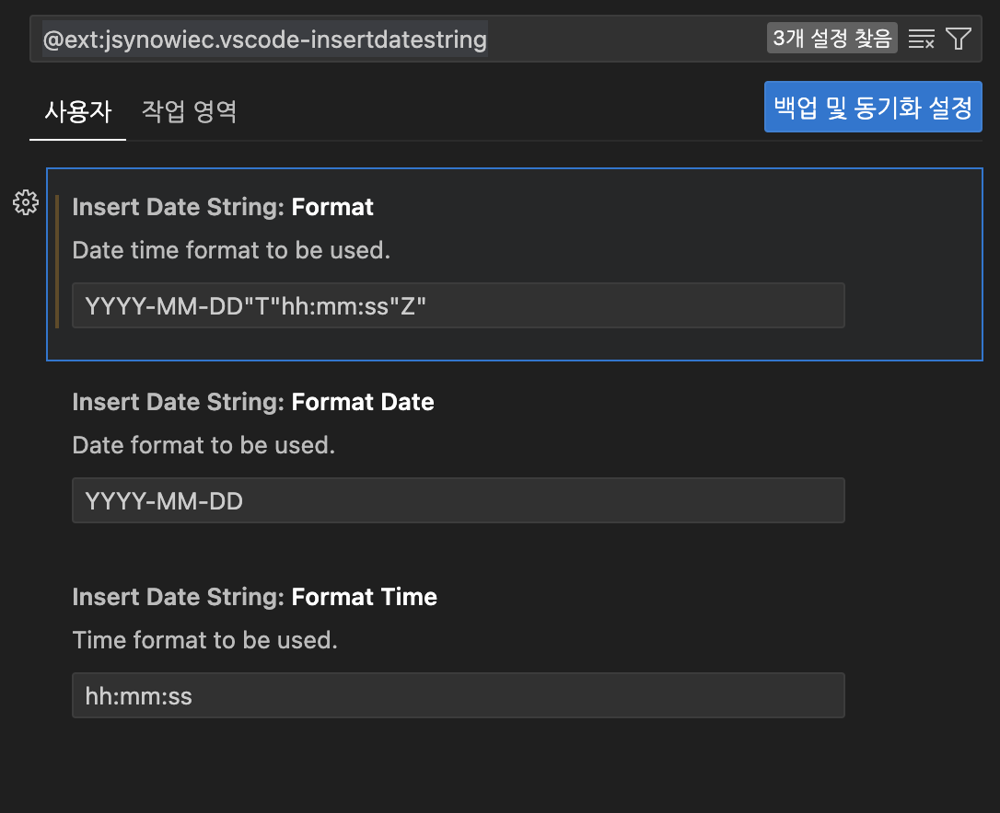
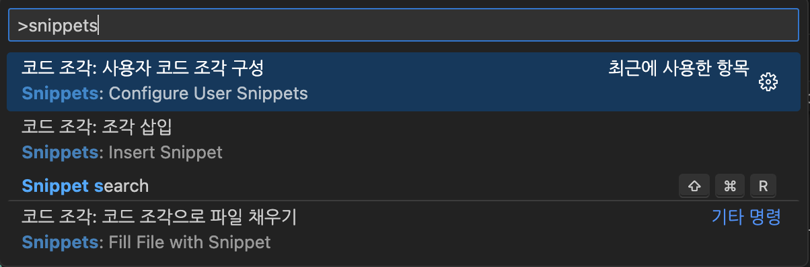
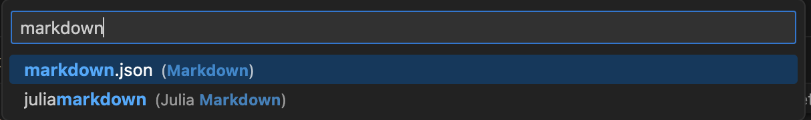
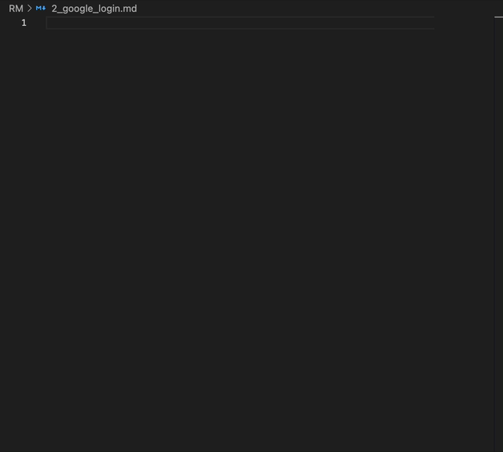
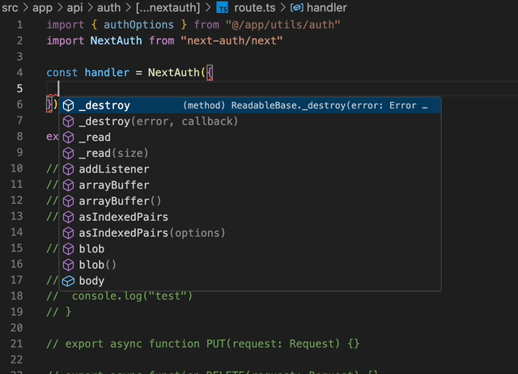
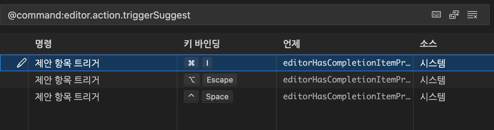

## markdown Snippet

### Insert Date String

[](https://marketplace.visualstudio.com/items?itemName=jsynowiec.vscode-insertdatestring)
🔗 링크 : [Insert Date String(Vscode)](https://marketplace.visualstudio.com/items?itemName=jsynowiec.vscode-insertdatestring)

### 출력 형식 설정

```text
YYYY-MM-DD"T"hh:mm:ss"Z"
```



### Snippet

> [!NOTE]
> 상위 [Insert Date String](#insert-date-string)을 설치해주세요

### Markdown Snippet

> [!NOTE]
> VScode 설정 탐색 단축키
> ⌘(command) + ⇧(shift) + P

snippets 검색



markdown snippet 설정 파일 생성



#### 📃 Markdown.json

파일 설정

```json
{
	"File header": {
		"prefix": "header",
		"body": [
			"---"
			"title: $TM_FILENAME",
			"description: |-",
			"	내용입력"
			"date: ${date:Insert datetime string (⇧⌘I or Ctrl+Shift+I)}"
			"preview: 이미지 주소"
			"draft: false"
			"tags:"
			"	- 테그없음"
			"categories:"
			"	- 카테고리없음"
			"---"
		]
	}
}
```

#### 🚀 사용법

생성한 이름으로 자동완성을 불러온다



> [!WARNING]
> 자동완성이 안될경우 하위 setting.json에 추가해주세요

#### 📃 settings.json

```json
{
    "[markdown]": {
        "editor.quickSuggestions": {
            "other": "on",
            "comments": "off",
            "strings": "on"
        },
        "editor.wordBasedSuggestions": "matchingDocuments"
    },
    "editor.snippetSuggestions": "top",
    "insertDateString.format": "YYYY-MM-DD\"T\"hh:mm:ss\"Z\""
}
```

### Trigger Suggest

mac의 경우 한국어가 control + command 로 되어있기 때문에 트리거가 작동하지 않는다



```@command:editor.action.triggerSuggest```에 자동 완성 단축키들이 있다

