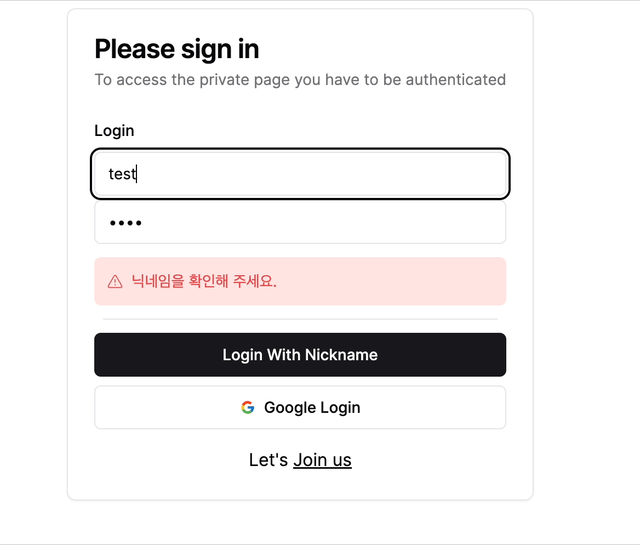

## zod 란?

런타임 상태의 타입과 적합함을 확인하기 위한 라이브러리이다

```bash
npm i zod
npm i react-hook-form
```

### 스키마 작성

> [!NOTE]
> 스키마를 작성하여 값들의 설정을 해준다

🍝 ```/src/schemas/index.ts```

```ts
import { z } from "zod"

export const LoginSchema = z.object({
	nickname: z.string().min(1, {message: "유저를 확인해 주세요"}),
	password: z.string().min(1, {message: "패스워드를 확인해 주세요"})
})
```

### 클라이언트 폼 확인

> [!NOTE]
> 사용자가 실제 값을 잘못 작성 하였을 경우 표시됨



🍝 ```/src/components/auth/UserSignIn.tsx```

```tsx
function UserSignIn(props: UserSignInProps) {
	const [isPending, startTransition] = useTransition();
	const loginForm = useForm<z.infer<typeof LoginSchema>>({
		resolver: zodResolver(LoginSchema),
		defaultValues: {
			nickname: "",
			password: "",
		}
	})
	function loginWithUser (values: z.infer<typeof LoginSchema>) {
		startTransition(() => {
			userLogin(values).then((value) => {
				console.log(value)
			})
		})
	}
	return (
		<Form {...loginForm}>
			<form onSubmit={loginForm.handleSubmit(loginWithUser)}
				className='flex flex-col gap-y-1'>
				<FormField control={loginForm.control} name="nickname" render={({ field }) =>
					<FormItem>
						<FormLabel>Login</FormLabel>
						<FormControl>
							<Input {...field} type='text' placeholder='nickname' required></Input>
						</FormControl>
						<FormMessage />
					</FormItem>
				} />
				<FormField control={loginForm.control} name="password" render={({ field }) =>
					<FormItem>
						<FormControl>
							<Input {...field} type='password' placeholder='password' required></Input>
						</FormControl>
						<FormMessage />
					</FormItem>
				} />
				<hr className='m-2' />
				<Button type='submit' >Login With Nickname</Button>
			</form>
		</Form >
	)
}
```

### 서버 타입 확인

타입을 제공해주기 때문에 좀더 편하게 사용이 가능하다

🍝 ```src/server/userLogin.ts```

```ts
type userLoginProps = {

} & z.infer<typeof LoginSchema>

async function userLogin(props: userLoginProps) {
	const validatedFieds = LoginSchema.safeParse(props);
	if (!validatedFieds.success || !db)
		return ({ error: "Invalid fields!" });
	const { nickname, password } = props;
	const findNickname = await db.userState.findUnique({
		where: { nickname }
	})
	if (!findNickname)
		return ({ error: "닉네임을 확인해 주세요." });
	if (!bcrypt.compareSync(props.password, findNickname.password))
		return ({ error: "비밀번호가 일치하지 않습니다." });
	return { success: "Login success" };
}
```
