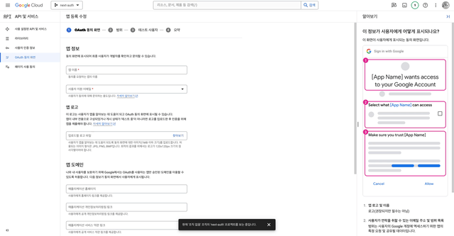
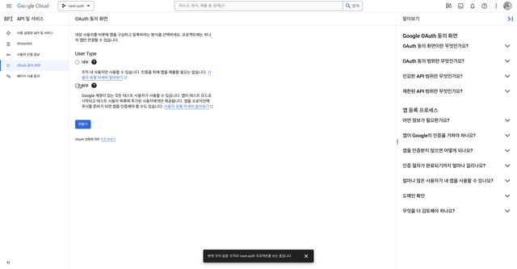
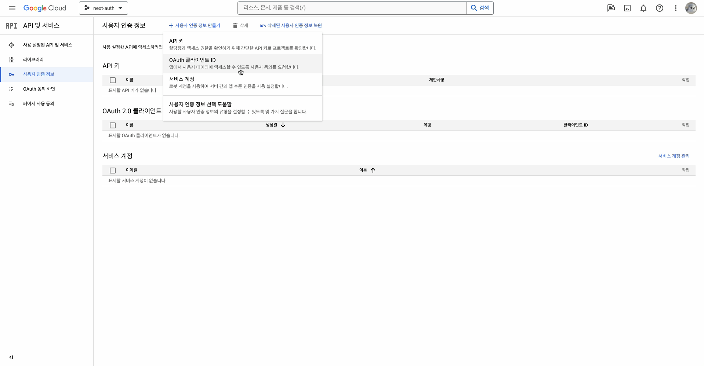
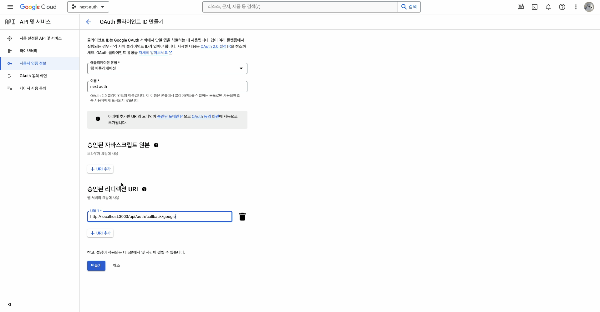
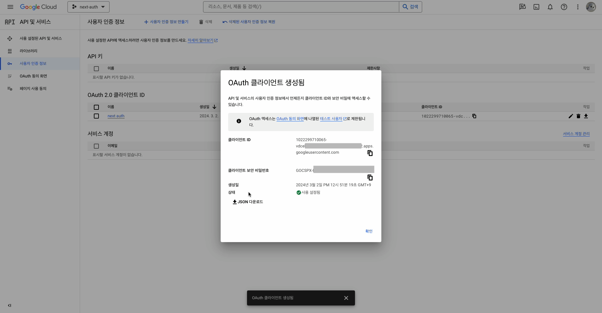
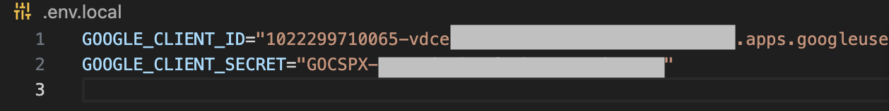

## Google Cloud OAuth 생성

> [!NOTE]
> OAuth ID를 만들 프로젝트 생성

새프로젝트 만들기



프로젝트 설정



## Google Client OAuth ID 생성

사용자 인증 정보를 들어가 OAuth 클라이언트 ID를 클릭



입력 사항을 입력

승인된 리디렉션 URL을 설정



발급받은 클라이언트 ID와 시크릿 키



환경변수 설정

> [!WARNING]
> local 뿐만 아니라 외부에도 사용한다면 파일명을 ```.env```로 설정해 주세요



### prisma adapter 설정

<https://authjs.dev/reference/adapter/prisma?_gl=1*4ner9z*_gcl_au*MTYyMDUyOTk5NS4xNzA5MTg4OTMy>

### prisma schema auth 설정

<https://next-auth.js.org/v3/adapters/prisma>


### useSession() Client side

<SessionProvider></SessionProvider>
로 레이아웃을 감싸 하위에서 사용할 수 있게 해준다
